<!-- AUTO:START -->

   

## `❯ gh pr list --author @me --state merged -L 20`

| | PR | Repo | Branch | Merged |
|:-:|---|---|:-:|---|
| ⚡ `PERF` | [stock: batch stock.move.line writes in _inverse_picked](https://github.com/odoo/odoo/pull/288302) | `odoo/odoo` | `17.0` | `2026-09-23` 🤖 |
| 🚚 `MIG` | [printer_zpl2](https://github.com/OCA/report-print-send/pull/466) | `OCA/report-print-send` | `19.0` | `2026-09-23` |
| ⚡ `PERF` | [base: cache barcode/QR PNG rendering with cache](https://github.com/odoo/odoo/pull/289135) | `odoo/odoo` | `18.0` | `2026-09-18` 🤖 |
| ✨ `IMP` | [orm: match parent_store descendants by range instead of LIKE](https://github.com/odoo/odoo/pull/287180) | `odoo/odoo` | `19.0` | `2026-09-08` 🤖 |
| 🐛 `FIX` | [account_financial_report: use 'in' on analytic_account_ids domain](https://github.com/OCA/account-financial-reporting/pull/1546) | `OCA/account-financial-reporting` | `18.0` | `2026-09-08` |
| ✨ `IMP` | [l10n_it_edi_extension: batch-write EDI amount fields on import](https://github.com/OCA/l10n-italy/pull/5192) | `OCA/l10n-italy` | `18.0` | `2026-08-21` |
| 🐛 `FIX` | [l10n_it_edi: apply fiscal position to imported bill taxes](https://github.com/odoo/odoo/pull/274738) | `odoo/odoo` | `18.0` | `2026-07-10` 🤖 |
| 🐛 `FIX` | [l10n_it_central_journal_reportlab: exclude notes and sections from rep](https://github.com/OCA/l10n-italy/pull/5225) | `OCA/l10n-italy` | `16.0` | `2026-06-12` |
| 🐛 `FIX` | [l10n_it_central_journal_reportlab: exclude notes and sections from rep](https://github.com/OCA/l10n-italy/pull/4905) | `OCA/l10n-italy` | `18.0` | `2026-06-11` |
| 🐛 `FIX` | [l10n_it_vat_settlement_communication: fix for check_identificativo in ](https://github.com/OCA/l10n-italy/pull/5194) | `OCA/l10n-italy` | `18.0` | `2026-06-05` |
| 🐛 `FIX` | [l10n_it_delivery_note :hide message of draft invoices checking also th](https://github.com/OCA/l10n-italy/pull/4841) | `OCA/l10n-italy` | `18.0` | `2026-06-05` |
| 🐛 `FIX` | [l10n_it_edi_related_document: skip empty IdDocumento](https://github.com/OCA/l10n-italy/pull/5199) | `OCA/l10n-italy` | `18.0` | `2026-06-05` |
| ✨ `IMP` | [l10n_it_edi_extension: adapt FatturaPA import to core](https://github.com/OCA/l10n-italy/pull/5198) | `OCA/l10n-italy` | `18.0` | `2026-06-05` |
| 🐛 `FIX` | [partner_firstname: fallback for empty names on create](https://github.com/OCA/partner-contact/pull/2351) | `OCA/partner-contact` | `18.0` | `2026-05-29` |
| 🐛 `FIX` | [account_financial_report: skip line_subsection in domains](https://github.com/OCA/account-financial-reporting/pull/1511) | `OCA/account-financial-reporting` | `19.0` | `2026-05-20` |
| 🐛 `FIX` | [l10n_it_edi: read DataScadenzaPagamento on issued invoices](https://github.com/odoo/odoo/pull/264573) | `odoo/odoo` | `18.0` | `2026-05-15` 🤖 |
| 🐛 `FIX` | [l10n_it_edi: avoid hard reference to account.edi.common](https://github.com/odoo/odoo/pull/264326) | `odoo/odoo` | `18.0` | `2026-05-13` 🤖 |
| ♻️ `REF` | [l10n_it_fatturapa_in: moved the partner vals to dedicated prepare](https://github.com/OCA/l10n-italy/pull/5185) | `OCA/l10n-italy` | `16.0` | `2026-05-04` |
| 🐛 `FIX` | [l10n_it_edi_extension: fix for unexpected keywoard 'vat_only'](https://github.com/OCA/l10n-italy/pull/5162) | `OCA/l10n-italy` | `18.0` | `2026-04-03` |
| 🐛 `FIX` | [sale_project: fix for KeyError if not in project user group](https://github.com/odoo/odoo/pull/252687) | `odoo/odoo` | `19.0` | `2026-03-20` 🤖 |

## `❯ gh pr list --author @me --state open -L 20`

| | PR | Repo | Branch | Aperta | Età |
|:-:|---|---|:-:|---|:-:|
| 🐛 `FIX` | [stock: find push rule based on active companies](https://github.com/odoo/odoo/pull/290172) | `odoo/odoo` | `17.0` | `2026-09-23` | 🟢 3g |
| 🐛 `FIX` | [l10n_it_riba_oca: balance the settlement move on a partial slip](https://github.com/OCA/l10n-italy/pull/5336) | `OCA/l10n-italy` | `18.0` | `2026-09-22` | 🟢 4g |
| 🚚 `MIG` | [product_multi_company_stock: Migration to 19.0](https://github.com/OCA/multi-company/pull/1060) | `OCA/multi-company` | `19.0` | `2026-09-22` | 🟢 4g |
| 🚚 `MIG` | [account_fiscal_position_allowed_journal](https://github.com/OCA/account-financial-tools/pull/2391) | `OCA/account-financial-tools` | `18.0` | `2026-09-22` | 🟢 4g |
| 🐛 `FIX` | [account_financial_report: flatten nested css so pdf styles apply](https://github.com/OCA/account-financial-reporting/pull/1577) | `OCA/account-financial-reporting` | `19.0` | `2026-09-21` | 🟢 5g |
| 🐛 `FIX` | [account_financial_report: flatten nested css so pdf styles apply](https://github.com/OCA/account-financial-reporting/pull/1575) | `OCA/account-financial-reporting` | `18.0` | `2026-09-21` | 🟢 5g |
| ⚡ `PERF` | [stock: build the forecast report lines without per-line reads](https://github.com/odoo/odoo/pull/289241) | `odoo/odoo` | `19.0` | `2026-09-18` | 🟢 8g |
| ⚡ `PERF` | [delivery: skip the source totals when no carrier limit applies](https://github.com/odoo/odoo/pull/289235) | `odoo/odoo` | `19.0` | `2026-09-18` | 🟢 8g |
| ⚡ `PERF` | [stock: cache only the quants the validation loop can read](https://github.com/odoo/odoo/pull/288959) | `odoo/odoo` | `17.0` | `2026-09-17` | 🟢 9g |
| ⚡ `PERF` | [stock: batch package weight queries in _compute_shipping_weight](https://github.com/odoo/odoo/pull/288005) | `odoo/odoo` | `19.0` | `2026-09-14` | 🟢 12g |
| 🐛 `FIX` | [base_report_to_printer: forward doc_format, and guard neutralize.sql](https://github.com/OCA/report-print-send/pull/478) | `OCA/report-print-send` | `19.0` | `2026-09-08` | 🟢 18g |
| 🐛 `FIX` | [l10n_it_asset_management: monthly depreciation pro rata](https://github.com/OCA/l10n-italy/pull/5300) | `OCA/l10n-italy` | `18.0` | `2026-09-04` | 🟢 22g |
| ⚡ `PERF` | [stock: skip report line details in forecast availability](https://github.com/odoo/odoo/pull/286695) | `odoo/odoo` | `19.0` | `2026-09-04` | 🟢 22g |
| 🐛 `FIX` | [l10n_it_edi_doi_extension: wrong sign on sale refunds in _compute_invo](https://github.com/OCA/l10n-italy/pull/5297) | `OCA/l10n-italy` | `18.0` | `2026-09-02` | 🟢 24g |
| 🐛 `FIX` | [tools: export code terms from nested addons paths](https://github.com/odoo/odoo/pull/285970) | `odoo/odoo` | `17.0` | `2026-09-01` | 🟢 25g |
| 🐛 `FIX` | [repair: read owner availability from the product source location](https://github.com/odoo/odoo/pull/285715) | `odoo/odoo` | `18.0` | `2026-08-31` | 🟢 26g |
| 🐛 `FIX` | [account_invoice_start_end_dates: Avoid same-label warning](https://github.com/OCA/account-closing/pull/377) | `OCA/account-closing` | `19.0` | `2026-06-22` | 🔴 96g |
| 🐛 `FIX` | [sale_purchase: skip purchase generation for non-positive service qty](https://github.com/odoo/odoo/pull/270525) | `odoo/odoo` | `18.0` | `2026-06-17` | 🔴 101g |
| 🐛 `FIX` | [purchase_stock, stock: avoid spurious return on PO qty edit with sub-l](https://github.com/odoo/odoo/pull/262969) | `odoo/odoo` | `18.0` | `2026-05-06` | 🔴 143g |
| ✨ `IMP` | [survey: implement search on question_ids and page_ids](https://github.com/odoo/odoo/pull/255794) | `odoo/odoo` | `17.0` | `2026-03-25` | 🔴 185g |

🤖 = mergiata da bot (es. robodoo) · 📝 = draft · età: 🟢 &lt;30g 🟡 &lt;90g 🔴 stale

<picture>
  <source media="(prefers-color-scheme: dark)" srcset="assets/snake-dark.svg"/>
  
</picture>

⚙️ build <code>2026-09-26 18:29 UTC</code> · generato da GitHub Actions · `exit 0`

<!-- AUTO:END -->

